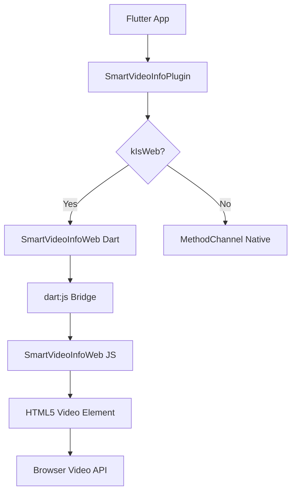
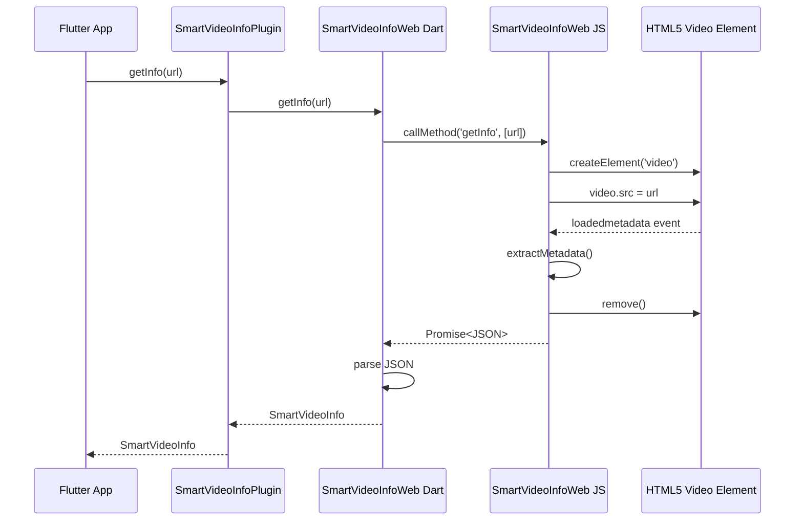

# Design Document: Web Video Metadata Extraction

## Overview

This design specifies the implementation of web platform support for the smart_video_info Flutter plugin. The web implementation uses the HTML5 Video API accessed through JavaScript, with a Dart-JavaScript bridge for integration with the Flutter plugin architecture.

The design follows the established pattern used by other platforms (Android, iOS, macOS, Windows) where platform-specific code extracts metadata and returns it in JSON Schema v1 format. However, the web platform has unique constraints:

- **URL-only access**: No local file system access; videos must be loaded via http://, https://, or blob: URLs
- **Limited metadata**: HTML5 Video API doesn't expose codec details, bitrate, fps, or rotation directly
- **Estimation required**: Some properties (codec, fps) must be estimated from URL patterns or set to defaults
- **Asynchronous loading**: Video metadata loading is event-driven and requires timeout handling

The implementation consists of two layers:

1. **JavaScript layer** (web/smart_video_info.js): Core metadata extraction using HTML5 Video API
2. **Dart layer** (lib/src/smart_video_info_web.dart): Bridge to JavaScript using dart:js interop

## Architecture

### Component Diagram



### Data Flow



### File Structure

```
lib/src/
  smart_video_info_web.dart       # Dart bridge layer
  smart_video_info_plugin.dart    # Main plugin (routes to web)
  smart_video_info_model.dart     # Data model

web/
  smart_video_info.js             # JavaScript implementation
```

## Components and Interfaces

### JavaScript Layer (web/smart_video_info.js)

#### SmartVideoInfoWeb Class

```javascript
class SmartVideoInfoWeb {
  constructor()

  // Extract metadata from single video URL
  // Returns: Promise<{success: boolean, data?: object, error?: string}>
  async getInfo(url: string): Promise<object>

  // Extract metadata from video element
  // Returns: metadata object matching JSON Schema v1
  extractMetadata(video: HTMLVideoElement, url: string): object

  // Extract metadata from multiple URLs
  // Returns: Promise<string[]> - array of JSON strings
  async getBatch(urls: string[]): Promise<string[]>
}
```

#### getInfo Method

**Purpose**: Load video and extract metadata asynchronously

**Algorithm**:

1. Validate URL format (http://, https://, blob:)
2. Create video element with configuration:
   - preload = 'metadata'
   - muted = true
   - display = 'none'
3. Append video element to document.body
4. Set up timeout handler (10 seconds)
5. Register event listeners:
   - loadedmetadata: extract metadata, cleanup, resolve
   - error: cleanup, reject
6. Set video.src = url
7. Return Promise

**Error Handling**:

- Invalid URL: reject immediately
- Load error: reject with video.error.message
- Timeout: reject with "Metadata extraction timed out"
- Extraction error: reject with "Failed to extract metadata"

**Cleanup**: Always remove video element from DOM

#### extractMetadata Method

**Purpose**: Extract all available metadata from loaded video element

**Algorithm**:

1. Read dimensions: videoWidth, videoHeight
2. Validate dimensions > 0
3. Calculate duration: duration \* 1000 (convert to ms)
4. Extract container from URL extension
5. Detect codec from URL patterns:
   - .mp4/.m4v → h264
   - .webm → vp8
   - .ogv → theora
   - default → unknown
6. Detect audio:
   - Check mozHasAudio (Firefox)
   - Check webkitAudioDecodedByteCount (Chrome)
   - Check audioTracks.length (standard)
7. Detect subtitles: textTracks.length > 0
8. Calculate streamCount: 1 + audioTracks.length
9. Build metadata object with defaults:
   - bitrate = 0
   - fps = 30.0
   - rotation = 0
10. Add audio metadata if hasAudio:
    - audioCodec = "unknown"
    - sampleRate = 44100
    - channels = 2
11. Return metadata object

**Returns**: Object matching JSON Schema v1 data structure

#### getBatch Method

**Purpose**: Process multiple videos sequentially

**Algorithm**:

1. Initialize empty results array
2. For each URL:
   - Call getInfo(url)
   - Await result
   - Stringify result
   - Append to results
   - If error: throw immediately
3. Return results array

**Error Handling**: First error stops processing and propagates

### Dart Layer (lib/src/smart_video_info_web.dart)

#### SmartVideoInfoWeb Class

```dart
class SmartVideoInfoWeb {
  // Extract metadata from single video URL
  static Future<SmartVideoInfo> getInfo(String path)

  // Extract metadata from multiple URLs
  static Future<List<SmartVideoInfo>> getBatch(List<String> paths)

  // Check if video is supported
  static Future<bool> isSupported(String path)
}
```

#### getInfo Method

**Purpose**: Bridge Dart to JavaScript for single video extraction

**Algorithm**:

1. Import dart:js library
2. Get SmartVideoInfoWeb constructor from window
3. Instantiate JS object: JsObject(constructor)
4. Call getInfo method: jsObject.callMethod('getInfo', [path])
5. Convert Promise to Future: promiseToFuture(jsPromise)
6. Parse JSON response: jsonDecode(jsonString)
7. Validate success field
8. If success: extract data, create SmartVideoInfo.fromJson
9. If failure: throw SmartVideoInfoException with error message
10. Apply timeout wrapper (10 seconds)

**Error Handling**:

- JavaScript exception: catch and convert to SmartVideoInfoException
- Timeout: throw SmartVideoInfoException with code 'TIMEOUT'
- Invalid JSON: throw FormatException
- Missing success field: throw SmartVideoInfoException

#### getBatch Method

**Purpose**: Bridge Dart to JavaScript for batch extraction

**Algorithm**:

1. Return empty list if paths is empty
2. Instantiate JS SmartVideoInfoWeb object
3. Call getBatch method: jsObject.callMethod('getBatch', [paths])
4. Convert Promise to Future
5. Parse each JSON string in results array
6. Validate success field for each
7. Create SmartVideoInfo objects from data
8. Return list of SmartVideoInfo
9. Apply timeout wrapper (30 seconds for batch)

**Error Handling**: Same as getInfo, plus batch-specific errors

#### isSupported Method

**Purpose**: Check if video URL is valid and loadable

**Algorithm**:

1. Try to call getInfo(path)
2. If succeeds and width > 0 and height > 0: return true
3. If any exception: return false (don't propagate)

**Returns**: boolean indicating support

### Integration with Plugin Architecture

The main plugin (SmartVideoInfoPlugin) uses conditional routing:

```dart
static Future<SmartVideoInfo> getInfo(String path) async {
  if (kIsWeb) {
    return SmartVideoInfoWeb.getInfo(path);
  }
  // Native platform code...
}
```

This ensures web implementation is used when running on web platform, while maintaining identical API surface.

## Data Models

### JSON Schema v1 (JavaScript → Dart)

**Success Response**:

```json
{
  "success": true,
  "data": {
    "width": 1920,
    "height": 1080,
    "duration": 120000,
    "codec": "h264",
    "bitrate": 0,
    "fps": 30.0,
    "rotation": 0,
    "container": "mp4",
    "audioCodec": "unknown",
    "sampleRate": 44100,
    "channels": 2,
    "hasAudio": true,
    "hasSubtitles": false,
    "streamCount": 2
  }
}
```

**Error Response**:

```json
{
  "success": false,
  "error": "Failed to load video: NetworkError"
}
```

### SmartVideoInfo Model (Dart)

Already defined in lib/src/smart_video_info_model.dart. The web implementation must populate all fields according to the model's requirements:

- **Required fields**: width, height, duration, codec, bitrate, fps, rotation, container, hasAudio, hasSubtitles, streamCount
- **Optional fields**: audioCodec, sampleRate, channels (null when hasAudio is false)
- **Validation**: Model constructor asserts non-negative values for numeric fields

### URL Validation

**Valid URL patterns**:

- `http://example.com/video.mp4`
- `https://example.com/video.mp4`
- `blob:http://example.com/uuid`

**Invalid patterns**:

- `/path/to/local/file.mp4` (local file path)
- `file:///path/to/file.mp4` (file protocol)
- `data:video/mp4;base64,...` (data URL - not supported)

### Codec Detection Mapping

| URL Pattern | Detected Codec |
| ----------- | -------------- |
| .mp4, .m4v  | h264           |
| .webm       | vp8            |
| .ogv        | theora         |
| other       | unknown        |

### Default Values for Web Platform

| Property   | Value     | Reason                         |
| ---------- | --------- | ------------------------------ |
| bitrate    | 0         | Not available in HTML5 API     |
| fps        | 30.0      | Common default, not detectable |
| rotation   | 0         | Not available in HTML5 API     |
| audioCodec | "unknown" | Not detectable from API        |
| sampleRate | 44100     | Standard CD quality default    |
| channels   | 2         | Stereo default                 |

## Correctness Properties

A property is a characteristic or behavior that should hold true across all valid executions of a system—essentially, a formal statement about what the system should do. Properties serve as the bridge between human-readable specifications and machine-verifiable correctness guarantees.

### Property Reflection

After analyzing all acceptance criteria, I identified the following redundancies:

- Properties 4.5, 4.6, 4.7 (bitrate=0, fps=30.0, rotation=0) can be combined into a single "web platform defaults" property
- Properties 5.1, 5.2, 5.3 (audio metadata defaults) can be combined into a single property
- Properties 9.2 and 9.4 overlap (success response structure) and can be combined
- Properties 9.5 and 9.6 are complementary and can be combined into one conditional property
- Property 6.6 is redundant with 9.3 (error response format)
- Several properties about codec detection (4.1-4.4) can be combined into a single mapping property

### URL Validation Properties

**Property 1: Valid URL acceptance**
_For any_ URL string starting with "http://", "https://", or "blob:", the system should accept it as valid input and not throw a validation error before attempting to load the video.
**Validates: Requirements 2.1**

**Property 2: Invalid URL rejection**
_For any_ path string that does not start with "http://", "https://", or "blob:", the system should reject it with error message "Web platform only supports URLs (http://, https://, blob:)" without creating a video element.
**Validates: Requirements 2.2**

### DOM Cleanup Properties

**Property 3: Video element cleanup**
_For any_ URL (valid or invalid), after calling getInfo completes (success or failure), the DOM should contain no video elements created by the system.
**Validates: Requirements 2.6**

### Metadata Extraction Properties

**Property 4: Dimension extraction accuracy**
_For any_ valid video URL, the extracted width and height should match the video's actual videoWidth and videoHeight properties.
**Validates: Requirements 3.1, 3.2**

**Property 5: Duration conversion accuracy**
_For any_ valid video URL, the extracted duration in milliseconds should equal the video's duration property multiplied by 1000 (rounded to integer).
**Validates: Requirements 3.3**

**Property 6: Container extraction from URL**
_For any_ URL with a file extension, the extracted container should equal the lowercase file extension from the URL path.
**Validates: Requirements 3.5**

**Property 7: Stream count calculation**
_For any_ valid video, the streamCount should equal 1 (video track) plus the number of audio tracks detected.
**Validates: Requirements 3.8**

### Codec Detection Properties

**Property 8: Codec detection from URL patterns**
_For any_ URL, the detected codec should follow this mapping:

- URLs containing ".mp4" or ".m4v" → "h264"
- URLs containing ".webm" → "vp8"
- URLs containing ".ogv" → "theora"
- All other URLs → "unknown"
  **Validates: Requirements 4.1, 4.2, 4.3, 4.4**

### Web Platform Default Properties

**Property 9: Web platform default values**
_For any_ valid video extracted on web platform, the following defaults should always apply:

- bitrate = 0
- fps = 30.0
- rotation = 0
  **Validates: Requirements 4.5, 4.6, 4.7**

### Audio Metadata Properties

**Property 10: Audio metadata defaults when audio present**
_For any_ video where hasAudio is true, the following audio metadata should be set:

- audioCodec = "unknown"
- sampleRate = 44100
- channels = 2
  **Validates: Requirements 5.1, 5.2, 5.3**

**Property 11: Audio metadata null when audio absent**
_For any_ video where hasAudio is false, the audioCodec, sampleRate, and channels fields should all be null.
**Validates: Requirements 5.4**

### Error Handling Properties

**Property 12: Video load error handling**
_For any_ URL that fails to load (network error, CORS, invalid video), the system should reject with an error message (either from video.error.message or "Failed to load video").
**Validates: Requirements 6.1**

**Property 13: Exception conversion to rejection**
_For any_ exception thrown during metadata extraction, the system should catch it and reject with error message "Failed to extract metadata" rather than propagating the exception.
**Validates: Requirements 6.3**

**Property 14: Error response format**
_For any_ failed extraction, the JSON response should have success: false and include an error field with a descriptive string.
**Validates: Requirements 6.6, 9.3**

### Batch Processing Properties

**Property 15: Batch order preservation**
_For any_ array of URLs processed by getBatch, the results array should contain metadata in the same order as the input URLs.
**Validates: Requirements 8.5**

**Property 16: Batch failure propagation**
_For any_ batch containing at least one invalid URL, the entire getBatch operation should fail with an error (fail-fast behavior).
**Validates: Requirements 8.4**

**Property 17: Batch success consistency**
_For any_ batch of valid URLs where all extractions succeed, every result in the returned array should have success: true.
**Validates: Requirements 8.6**

### JSON Schema Compliance Properties

**Property 18: Success field presence**
_For any_ response (success or failure), the JSON should contain a top-level "success" boolean field.
**Validates: Requirements 9.1**

**Property 19: Success response structure**
_For any_ successful extraction, the JSON response should have success: true and include a "data" object containing all required fields: width, height, duration, codec, bitrate, fps, rotation, container, hasAudio, hasSubtitles, streamCount.
**Validates: Requirements 9.2, 9.4**

**Property 20: Conditional audio fields**
_For any_ response, if hasAudio is true, the data object should include audioCodec, sampleRate, and channels fields; if hasAudio is false, these fields should be absent or null.
**Validates: Requirements 9.5, 9.6**

**Property 21: Numeric field types**
_For any_ successful response, all numeric fields (width, height, duration, bitrate, fps, rotation, sampleRate, channels, streamCount) should have number type (not string type) in the JSON.
**Validates: Requirements 9.7**

**Property 22: Duration format**
_For any_ successful response, the duration field should be an integer representing milliseconds (not a float or string).
**Validates: Requirements 9.8**

### Dart-JavaScript Bridge Properties

**Property 23: JavaScript exception conversion**
_For any_ JavaScript error thrown during getInfo or getBatch, the Dart layer should catch it and convert it to a SmartVideoInfoException (not propagate as a generic exception).
**Validates: Requirements 10.5**

### Video Playback Prevention Property

**Property 24: No video playback during extraction**
_For any_ video processed by getInfo, the video should not be played or autoplayed during metadata extraction (video.played should remain false).
**Validates: Requirements 11.6**

### isSupported Method Properties

**Property 25: isSupported returns true for valid videos**
_For any_ valid video URL with width > 0 and height > 0, isSupported should return true.
**Validates: Requirements 12.3**

**Property 26: isSupported returns false for invalid videos**
_For any_ invalid video URL or video with invalid dimensions, isSupported should return false (not throw an exception).
**Validates: Requirements 12.4**

**Property 27: isSupported exception suppression**
_For any_ error occurring during isSupported execution, the method should return false rather than throwing an exception.
**Validates: Requirements 12.5**

### Serialization Round-Trip Property

**Property 28: JSON serialization round-trip**
_For any_ valid SmartVideoInfo object, serializing it to JSON (via the data field) and then parsing it back using SmartVideoInfo.fromJson should produce an equivalent object with the same field values.
**Validates: Requirements 13.7**

## Error Handling

### Error Categories

1. **Validation Errors**: Invalid URL format (not http://, https://, or blob:)
2. **Network Errors**: Failed to load video from URL (CORS, 404, network timeout)
3. **Video Errors**: Invalid video format, corrupted file, unsupported codec
4. **Dimension Errors**: Video with width=0 or height=0
5. **Timeout Errors**: Metadata loading exceeds 10 seconds
6. **JavaScript Errors**: Exceptions during video element manipulation
7. **Batch Errors**: One or more videos fail in batch operation

### Error Response Format

All errors follow the same JSON structure:

```json
{
  "success": false,
  "error": "Descriptive error message"
}
```

### Error Handling Strategy

**JavaScript Layer**:

- Validate URL before creating video element
- Set up error event listener before loading
- Implement timeout with cleanup
- Always remove video element from DOM (try-finally pattern)
- Return rejected Promise with structured error

**Dart Layer**:

- Catch JavaScript exceptions and convert to SmartVideoInfoException
- Parse error responses and extract error message
- Apply timeout wrapper at Dart level (defense in depth)
- Provide meaningful error messages to application

### Timeout Handling

- **Single video**: 10 seconds (Duration(seconds: 10))
- **Batch processing**: 30 seconds (Duration(seconds: 30))
- Timeout implemented at both JavaScript (per-video) and Dart (overall) layers
- On timeout: cleanup video element, reject with "Metadata extraction timed out"

### CORS Considerations

Web platform is subject to browser CORS restrictions:

- Videos from different origins may be blocked
- Error message will indicate CORS failure
- Application should handle CORS errors gracefully
- Consider using CORS proxy or same-origin videos for testing

## Testing Strategy

### Dual Testing Approach

The implementation requires both unit tests and property-based tests:

**Unit Tests**: Verify specific examples, edge cases, and error conditions

- Empty batch handling (example)
- Specific URL patterns (example)
- API surface validation (example)
- Integration between Dart and JavaScript layers

**Property Tests**: Verify universal properties across all inputs

- URL validation for random URLs
- Metadata extraction accuracy for various videos
- JSON schema compliance for all responses
- Error handling for invalid inputs
- Batch processing order and consistency

### Property-Based Testing Configuration

**Framework**: Use appropriate PBT library for Dart/JavaScript:

- Dart: Consider using `test` package with custom generators or `faker` for data generation
- JavaScript: Use `fast-check` library for property-based testing

**Test Configuration**:

- Minimum 100 iterations per property test
- Each test tagged with: **Feature: web-video-metadata, Property N: [property text]**
- Generate diverse test data: various URL formats, video dimensions, audio configurations

**Test Data Generation**:

- Valid URLs: http://, https://, blob: with various extensions
- Invalid URLs: file://, relative paths, data: URLs
- Video dimensions: small (320x240), medium (1280x720), large (1920x1080), edge cases (0x0)
- Container formats: mp4, webm, ogv, mkv, avi, unknown
- Audio configurations: with audio, without audio, multiple audio tracks

### Unit Test Coverage

**JavaScript Layer Tests** (web/smart_video_info.test.js):

- SmartVideoInfoWeb class instantiation
- getInfo with valid URL
- getInfo with invalid URL
- extractMetadata with mock video element
- getBatch with empty array
- getBatch with multiple URLs
- Timeout handling (using fake timers)
- Error event handling
- DOM cleanup verification

**Dart Layer Tests** (test/smart_video_info_web_test.dart):

- SmartVideoInfoWeb.getInfo integration
- SmartVideoInfoWeb.getBatch integration
- SmartVideoInfoWeb.isSupported behavior
- JSON parsing and model creation
- Exception handling and conversion
- Timeout behavior

**Integration Tests**:

- End-to-end flow from Dart through JavaScript to HTML5 API
- Platform routing (kIsWeb check)
- Real video URL processing (if test videos available)

### Property Test Examples

**Property 1 Test** (Valid URL acceptance):

```dart
test('Property 1: Valid URL acceptance', () {
  // Feature: web-video-metadata, Property 1: Valid URL acceptance
  final validPrefixes = ['http://', 'https://', 'blob:'];

  for (var i = 0; i < 100; i++) {
    final prefix = validPrefixes[random.nextInt(validPrefixes.length)];
    final url = '$prefix${generateRandomPath()}';

    // Should not throw validation error immediately
    expect(() => validateUrl(url), returnsNormally);
  }
});
```

**Property 8 Test** (Codec detection):

```dart
test('Property 8: Codec detection from URL patterns', () {
  // Feature: web-video-metadata, Property 8: Codec detection from URL patterns
  final testCases = [
    ('.mp4', 'h264'),
    ('.m4v', 'h264'),
    ('.webm', 'vp8'),
    ('.ogv', 'theora'),
    ('.avi', 'unknown'),
  ];

  for (var i = 0; i < 100; i++) {
    for (final testCase in testCases) {
      final url = 'https://example.com/video${testCase.$1}';
      final expectedCodec = testCase.$2;

      final codec = detectCodecFromUrl(url);
      expect(codec, equals(expectedCodec));
    }
  }
});
```

**Property 28 Test** (Round-trip serialization):

```dart
test('Property 28: JSON serialization round-trip', () {
  // Feature: web-video-metadata, Property 28: JSON serialization round-trip

  for (var i = 0; i < 100; i++) {
    final original = generateRandomSmartVideoInfo();

    // Serialize to JSON
    final json = {
      'success': true,
      'data': {
        'width': original.width,
        'height': original.height,
        'duration': original.duration.inMilliseconds,
        'codec': original.codec,
        'bitrate': original.bitrate,
        'fps': original.fps,
        'rotation': original.rotation,
        'container': original.container,
        'hasAudio': original.hasAudio,
        'hasSubtitles': original.hasSubtitles,
        'streamCount': original.streamCount,
        if (original.hasAudio) ...{
          'audioCodec': original.audioCodec,
          'sampleRate': original.sampleRate,
          'channels': original.channels,
        },
      },
    };

    // Parse back
    final parsed = SmartVideoInfo.fromJson(json['data']);

    // Verify equivalence
    expect(parsed.width, equals(original.width));
    expect(parsed.height, equals(original.height));
    expect(parsed.duration, equals(original.duration));
    expect(parsed.codec, equals(original.codec));
    // ... verify all fields
  }
});
```

### Test Execution

**Run all tests**:

```bash
flutter test
```

**Run web-specific tests**:

```bash
flutter test test/smart_video_info_web_test.dart
```

**Run with coverage**:

```bash
flutter test --coverage
```

### Testing Limitations

**Web Platform Constraints**:

- Cannot test with actual video files in unit tests (requires real browser environment)
- CORS restrictions may prevent loading test videos from external URLs
- Timeout tests are difficult to verify reliably (use fake timers in JavaScript tests)
- Browser-specific behavior (mozHasAudio, webkitAudioDecodedByteCount) may vary

**Recommended Approach**:

- Use mock video elements for JavaScript unit tests
- Use integration tests with real videos for end-to-end validation
- Test in multiple browsers (Chrome, Firefox, Safari) for compatibility
- Property tests focus on logic and data transformations, not actual video loading
